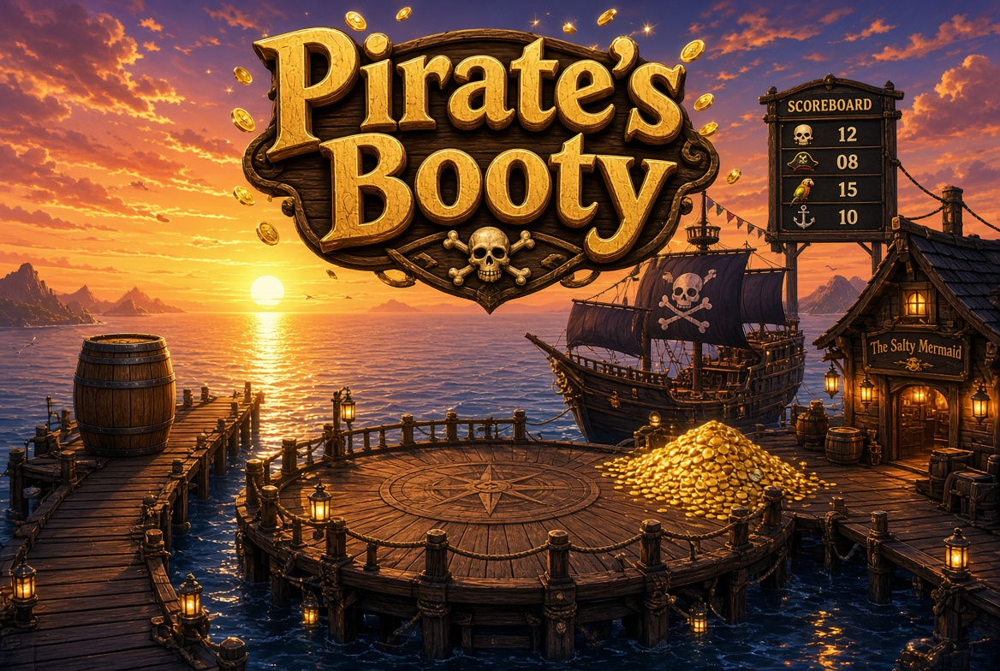

# Pirate Booty

World: [PirateBooty.dcl.eth](https://decentraland.org/jump/?realm=PirateBooty.dcl.eth)

Decentraland scene. Four minigames on a dock. Scoreboard is next to the captain NPC.

Click a sign on the pier to join. Water kills you.

## Games

**1. Deck Dodge**  
Race down a falling dock. Space to jump gaps. Dodge barrels / crates. Placement is whoever finishes first. Needs 2+ players for coins.

**2. Booty Loot**  
60 second grab. One coin at a time, stash it in *your* chest or it doesn't count. Sharks take whatever you're holding. Needs 2+ players for coins.

**3. Cannon Fodder**  
90 seconds. WASD aim, space to shoot (cooldown). First shot on a ship sinks it. Distance + speed = more coins. Needs 2+ players.

**4. Fishing**  
Pick a hole. Up/Down buttons move the line (depth is on the reel UI). Hook when a fish is near. If you hook one, mash reel and keep the marker in the green — if it clamps you lose the fish. This one pays even solo.

That's it. Mobile and desktop.
